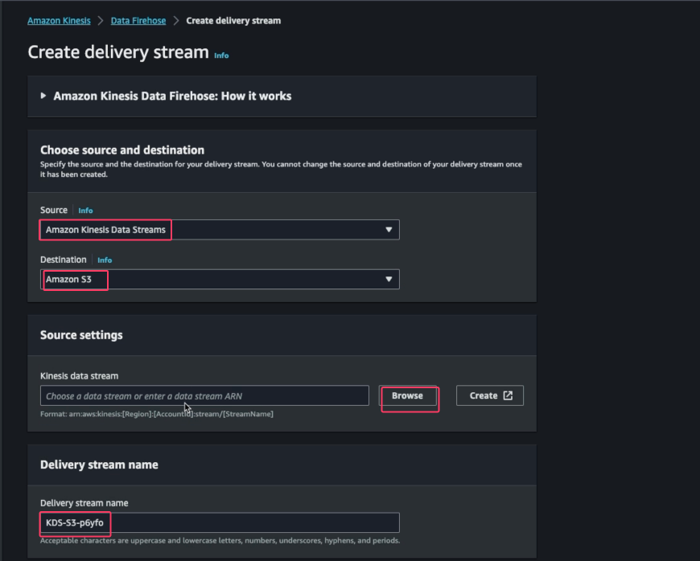
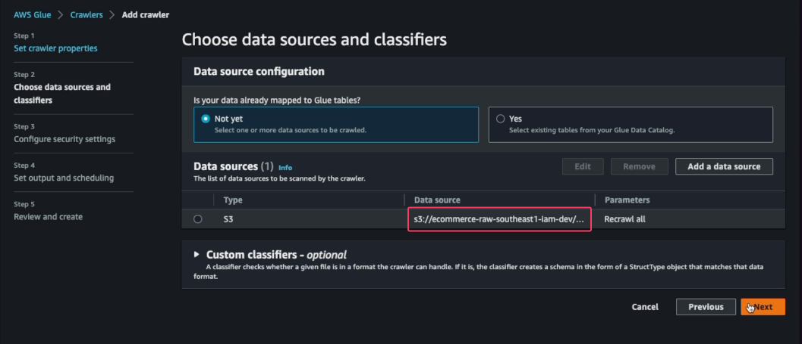
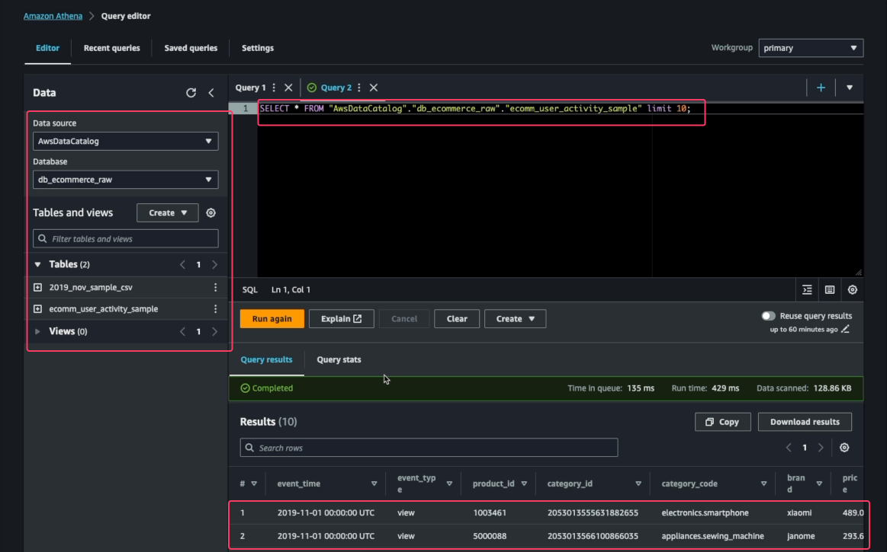
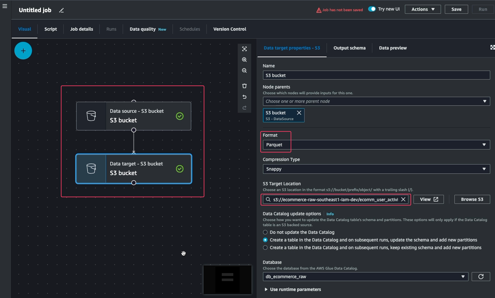
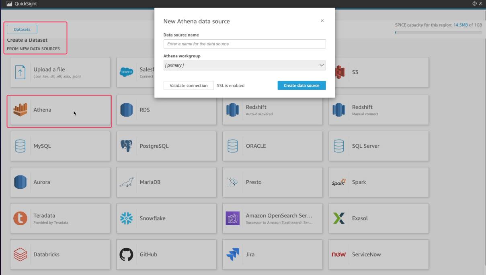
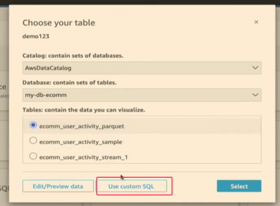
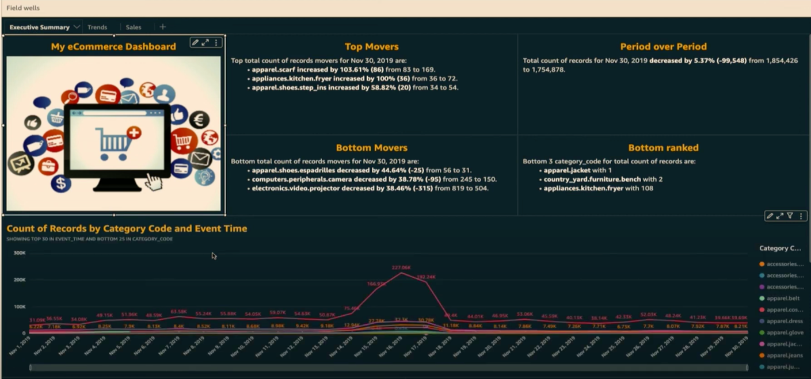

# Batch processing

In the second part of this project, we will dive deep and build the batch processing pipeline and build a dashboard using Amazon QuickSight, which will help us to get more insights about users. It will help us to know details like, who visits the e-commerce website more frequently, which are the top and bottom selling products, which are the top brands, and so on.

## Persisting All Raw Stream in S3 using Kinesis Firehose
Before processing the data, we need to store the raw data in somewhere without doing anything. So we use Amazon Kinesis Firehose to take the stream and save it to Amazon S3.
- Create a Kinesis Delivery Stream
  - Source : Kinesis Data Stream
  - Destination : Amazon S3
  - S3 Location : s3://ecommerce-raw-us-east-1-dev
  - Buffer interval : 60



## Create a Glue Crawler
Once the data is in S3, we can use Glue Crawler to define the schema of the raw CSV and use Amazon Athena to query on it.





## AWS Glue ETL
We can use AWS Glue Studio to create job. For example, transform the raw CSV file in S3 to parquet.

- ETL CSV to Parquet (This job will take a long time)
- Open AWS Glue > Glue Studio > Job > Name : ecomm-ETL-Job
- Select the follow:
  - Source S3 bucket : s3://ecommerce-raw-us-east-1-dev/ecomm_user_activity_concompressed/
  - Data Source Table : ecomm_user_activity_unconcompressed
  - Destination S3 bucket : s3://ecommerce-raw-us-east-1-dev/ecomm_user_activity_parquet/
  - Click on Create a table in the Data Catalog and on subsequent runs, update the schema and add new partitions
  - Destination Table : ecomm_user_activity_parquet
  - Select a Partition Key : category_id
  - Add the IAM Role under Job details
  - Run the JOB



## Build the dashboard using Quicksight
- Open QuickSight dashboard
  - New Dataset : sql_raw_user_activity



Moreover, we can create data with custom SQl.



```sql
SELECT  date_format(cast(event_time as timestamp), '%a' ) as Day,
      date_format(cast(event_time as timestamp), '%k' ) as Hour,
      event_type,
      category_code
FROM "my-db-ecomm"."ecomm_user_activity_parquet" LIMIT 10;

```

## Dashboard
