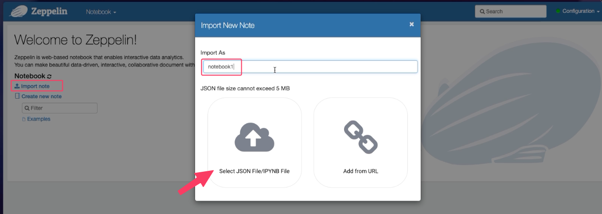
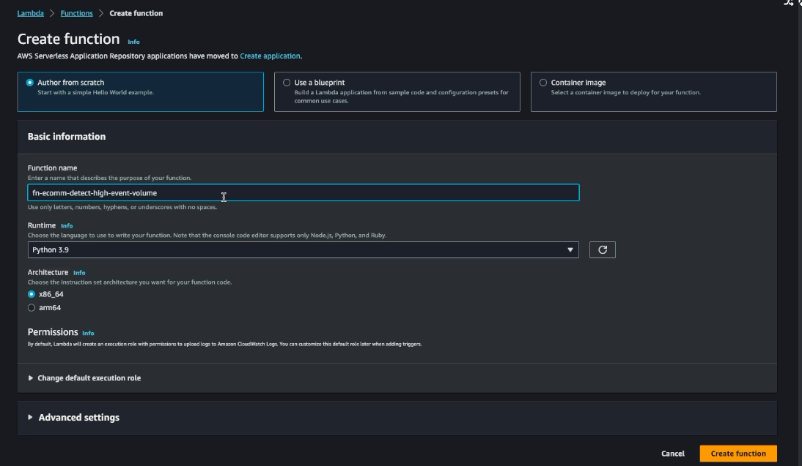
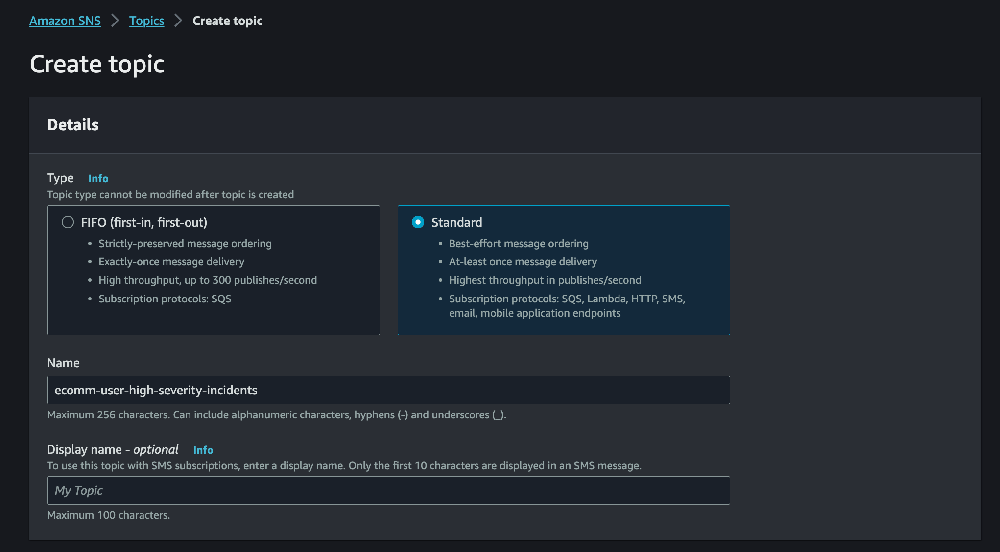
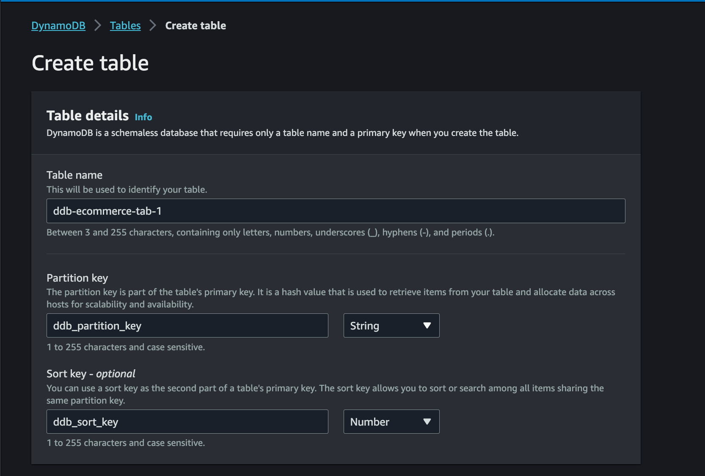
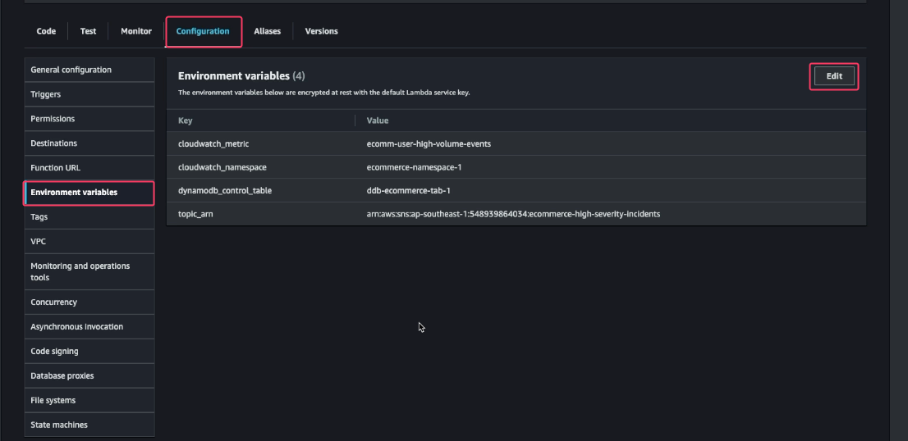
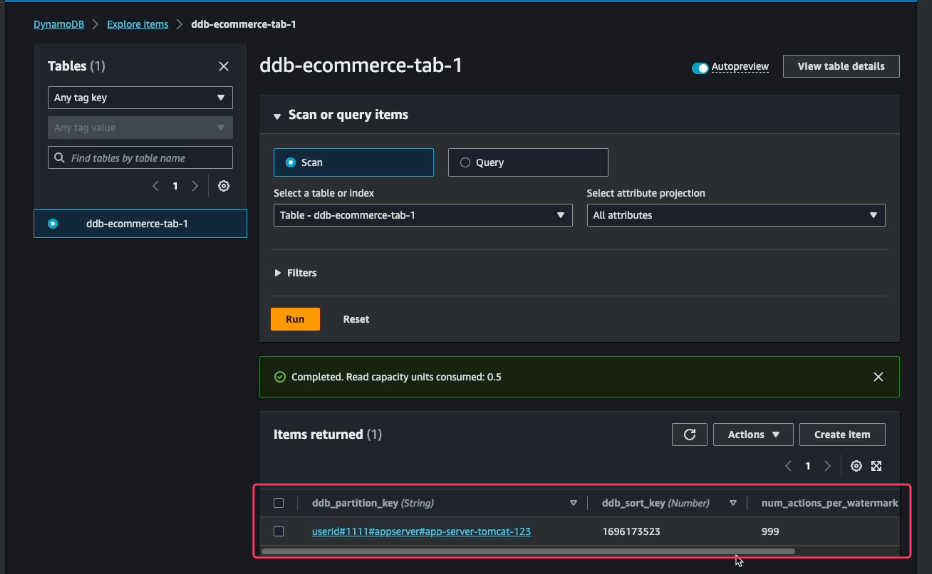

# Step-By-Step Walkthrough

## Download the Dataset and Copy it to Amazon S3
We can download this dataset on Kaggle by using Kaggle API.
- Create a sample version of the dataset

```shell
# Download dataset by using Kaggle API
kaggle datasets download -d mkechinov/ecommerce-behavior-data-from-multi-category-store

# Create sample first 1000 rows
unzip 2019-Nov.csv.zip
cat 2019-Nov.csv | head -n 1000 > 202019-Nov-sample.csv
```

## Create an Amazon S3 Bucket
Now we can create an S3 bucket and upload this dataset:
- Name of the Bucket:ecommerce-raw-southeast1-iam-dev (replace  <BUCKET_NAME> with your own bucket name)

```shell
aws s3 cp 2019-Nov.csv.zip s3://ecommerce-raw-southeast1-iam-dev/ecomm_user_activity/p_year-2019/p_month-11/

aws s3 cp 2019-Nov-sample.csv s3://ecommerce-raw-southeast1-iam-dev/ecomm_user_activity_sample
```

## Create the Kinesis Data Stream
Now, let's create the first Kinesis data stream (stream1 in our architecture diagram) which we will be using as the incoming stream. Open the AWS Console and then:
- Go to Amazon Kinesis.
- Click on Create data stream.


Let's create another Kinesis data stream which we are going to use later on (stream2 in the architecture diagram). This time use the data stream name as e-commerce-raw-user-activity-stream-2.

## Start the E-Commerce Traffic
We can now start the e-commerce traffic, as our Kinesis data stream is ready. This simulator which we are going to use is a simple [python script](src/stream-data-app-simulation.py) which will read the data from a CSV file (2019-Nov-sample.csv, the dataset which we downloaded earlier) line by line and send it to the Kinesis data stream (stream1).

But before you run the simulator, just edit the stream-data-app-simulation.py script with your <BUCKET_NAME> where you have the dataset.

Once it's updated, we can run the simulator.

```shell
pip install boto3

python streamstream-data-app-simulation.py

HttpStatusCode: 200 ,  electronics.smartphone
HttpStatusCode: 200 ,  appliances.sewing_machine
HttpStatusCode: 200 ,  
HttpStatusCode: 200 ,  appliances.kitchen.washer
HttpStatusCode: 200 ,  electronics.smartphone
HttpStatusCode: 200 ,  computers.notebook
HttpStatusCode: 200 ,  computers.notebook
HttpStatusCode: 200 ,  
HttpStatusCode: 200 ,  
HttpStatusCode: 200 ,  electronics.smartphone
```

## Integration with Kinesis Data Analytics and Apache Flink
Now, we will create an Amazon Kinesis Data Analytics Streaming Application which will analyze this incoming stream for any DDoS or bot attack. Open the AWS Console and then:

- Go to Amazon Kinesis.
- Select Analytics applications.
- Click on Studio notebooks.
- Click on Create Studio notebook.


- Use ecomm-streaming-app-v1 as the Studio notebook name.
- Under the Permissions section, click on Create to create an AWS Glue database, name the database as db-ecomm-raw. 
- Use the same database, db-ecomm-raw from the dropdown.
- Click on Create Studio notebook.


Now, select the ecomm-streaming-app-v1 Studio notebook and click on Open in Apache Zeppelin:


Once the Zeppelin Dashboard comes up, click on Import note and import this [notebook](src/sql-flink-ecomm-notebook-1.zpln):



Open the sql-flink-ecomm-notebook-1 notebook. Flink interpreters supported by Apache Zeppelin notebook are Python, IPython, stream SQL, or batch SQL, and we are going to use SQL to write our code. There are many different ways to create a Flink Application but one of the easiest ways is to use Zeppelin notebook. Let's look at this notebook and briefly discuss what are we doing here:

- First, we are creating a table for the incoming source of data (which is the e-commerce-raw-user-activity-stream-1 incoming stream).
- Next, we are creating another table for the filtered data (which is for the e-commerce-raw-user-activity-stream-2 outgoing stream).
- And finally, we are putting the logic to simulate the DDoS attack. We are essentially looking into the last 10 seconds of the data and grouping them by user_id. If we notice more than 5 records within that 10 seconds, Flink will take that user_id and the no. of records within those 10 seconds and will push that data to the e-commerce-raw-user-activity-stream-2 outgoing stream.

```sql
%flink.ssql
/*Option 'IF NOT EXISTS' can be used, to protect the existing Schema */
DROP TABLE IF EXISTS ecomm_user_activity_stream_1;
CREATE TABLE ecomm_user_activity_stream_1 (
`event_time` VARCHAR(30),
`event_type` VARCHAR(30),
`product_id` BIGINT,
`category_id` BIGINT,
`category_code` VARCHAR(30),
`brand` VARCHAR(30),
`price` DOUBLE,
`user_id` BIGINT,
`user_session` VARCHAR(30),
`txn_timestamp` TIMESTAMP(3),
  WATERMARK FOR txn_timestamp as txn_timestamp - INTERVAL '10' SECOND
)
PARTITIONED BY (category_id)
WITH (
'connector' = 'kinesis',
'stream' = 'e-commerce-raw-user-activity-stream-1',
'aws.region' = 'us-east-1',
'scan.stream.initpos' = 'LATEST',
'format' = 'json',
'json.timestamp-format.standard' = 'ISO-8601'
);
/*Option 'IF NOT EXISTS' can be used, to protect the existing Schema */
DROP TABLE IF EXISTS ecomm_user_activity_stream_2;
CREATE TABLE ecomm_user_activity_stream_2 (
`user_id` BIGINT,
`num_actions_per_watermark` BIGINT
)
WITH (
'connector' = 'kinesis',
'stream' = 'e-commerce-raw-user-activity-stream-2',
'aws.region' = 'us-east-1',
'format' = 'json',
'json.timestamp-format.standard' = 'ISO-8601'
);
/* Inserting aggregation into Stream 2*/
insert into ecomm_user_activity_stream_2select  user_id, count(1) as num_actions_per_watermarkfrom ecomm_user_activity_stream_1group by tumble(txn_timestamp, INTERVAL '10' SECOND), user_idhaving count(1) > 5;


```

## Create the Apache Flink Application
Now that we have our notebook imported, we can create the Flink Application from the notebook directly. To do that:
- Click on Actions for ecomm-streaming-app-v1 in the top right corner.
- Now we can deploy that application by simply clicking on Actions for ecomm-streaming-app-v1 on the top right corner.
- Click on Deploy sql-flink-ecomm-notebook-1 as Kinesis Analytics application > Deploy using AWS Console. 
- Scroll down and click on Save changes.  

This is the power of Kinesis Data Analytics: just from a simple Zeppelin Notebook, we can create a real-world application without any hindrance.

- Finally, we can start the application by clicking on Run. It might take a couple of minutes to start the application, so let's wait until we see the Status as Running. 

## Alarming DDoS Attack
If we revisit our architecture, we will see that we are almost done with the real-time/online processing. The only thing which is pending is to create a Lambda function which will be triggered whenever there is an entry of a record inside the e-commerce-raw-user-activity-stream-2 stream. The Lambda function would perform the following:

- Write that record into a DynamoDB table.
- Send an SNS notification.
- Update the CloudWatch metrics.

Let's first build the code for the Lambda function. The code is available under src/lamda_func_package folder.

```shell
# Install the aws_kinesis_agg package
cd src/lamda_func_package/
pip install aws_kinesis_agg -t .

# Build the lambda package and download the zip file.
zip -r ../lambda-package.zip .

# Upload the zip to S3
cd ..
aws s3 cp lambda-package.zip s3://ecommerce-raw-southeast1-iam-dev/src/lambda/
```

Now, let's create the Lambda function.
- Open the AWS Lambda console.
- Click on Create function button.
- Enter the Function name as fn_ecomm-detect-high-event-volume. 
- Enter the Runtime as Python 3.9.
- Click on Create function.



Once the Lambda function is created we need to upload the code which we stored in S3.

We need to provide adequate privileges to our Lambda function so that it can talk to Kinesis Data Streams, DynamoDB, CloudWatch, and SNS. To modify the IAM Role:
- Go to the Configuration tab > Permission tab on the left.
- Click on the Role Name.

Since this is just for the demo, we are adding Full Access, but it's NOT recommended for the production environment. We should always follow the least privilege principle to grant access to any user/resource.

Let's create the SNS Topic:
- Open the Amazon SNS console.
- Click on Create Topic.
- Select the Type as Standard. 
- Provide the Name as ecomm-user-high-severity-incidents. 
- Click on Create Topic.



Let's create a DynamoDB table:
- Open the Amazon DynamoDB console.
- Click on Create table.
- Create the table with the following details.

| Field           | Value    |
| --------        | -------- |
| Name            | ddb-ecommerce-tab-1   |
| Partition Key   | ddb_partition_key   |
| Secondary Key   | ddb_sort_key  |



Now, we can add the environment variables that are needed for the Lambda Function. These environment variables are used in the lambda function code.



## Deploy and Run Near Real Time End to End Data Pipeline

- Make sure the Flink App is RUNNING
- Push the Data from IDE
- Wait for 5-10 secs
- Go to Lambda and checking the CloudWatch Logs



Next part is [Batch processing](batch.md).